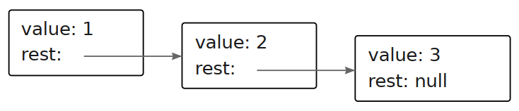

# A list

Objects, as generic blobs of values, can be used to build all sorts of data structures. A common data structure is the *list* (not to be confused with array). A
list is a nested set of objects, with the first object holding a reference to the
second, the second to the third, and so on.

```js
let list = {
  value: 1,
  rest: {
    value: 2,
    rest: {
      value: 3,
      rest: null
    }
  }
};
```

The resulting objects form a chain, like this:



A nice thing about lists is that they can share parts of their structure. For example, if I create two new values `{ value: 0, rest: list }` and `{ value: -1, rest: list }` (with `list` referring to the binding defined earlier), they are both independent lists, but they share the structure that makes up their last three elements. The original list is also still a valid three-element list.

Write a function `arrayToList` that builds up a list structure like the one shown when given `[1, 2, 3]` as argument. Also write a `listToArray` function that produces an array from a list. Then add a helper function `prepend`, which takes an element and a list and creates a new list that adds the element to the front of the input list, and `nth`, which takes a list and a number and returns the element at the given position in the list (with zero referring to the first element) or `undefined` when there is no such element.

If you haven’t already, also write a recursive version of `nth`.
